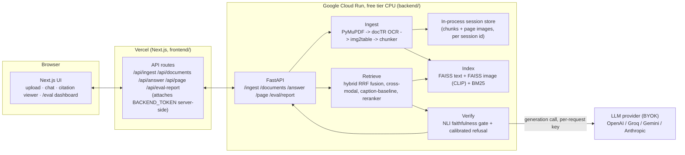

# Multimodal RAG — Trust Layer for Scanned Enterprise Documents


**Don't trust the LLM — verify it.** A document-QA system that answers
only what your documents actually support: every claim is checked against
retrieved evidence with an NLI model before it reaches you, answers refuse
outright when the grounding isn't there, table math is computed from the
parsed data instead of guessed by the LLM, and every citation points at an
exact pixel region on the source page.

### Recruiter TL;DR

- Full-stack multimodal RAG system (Next.js/Vercel + FastAPI/ML on Google
  Cloud Run's free tier) that ingests scanned PDFs/images — OCR, table
  extraction, layout-aware chunking — and answers questions with pixel-level
  citations.
- The hard problem solved: making an LLM's answer *trustworthy* rather than
  just plausible — a post-hoc NLI faithfulness gate verifies every generated
  claim against retrieved evidence and forces a refusal when nothing is
  actually grounded, and numeric table questions bypass the LLM entirely in
  favor of exact pandas arithmetic.
- Impact: on a 40-document DocVQA-derived corpus (30 answerable + 8
  deliberately out-of-corpus), the committed benchmark measures **recall@5 up
  to 0.80**, **MRR 0.62**, and **~0.79 refusal accuracy** across retrieval
  modes — and shows true CLIP cross-modal retrieval *losing* to an OCR-caption
  baseline on text-dense scans (recall@5 0.43 vs 0.80), a tradeoff this repo
  measures rather than assumes. Numbers are reproducible via
  [`BENCHMARK.md`](BENCHMARK.md) and live on the `/eval` dashboard.

**Live demo:** frontend — [multimodal-rag-plum.vercel.app](https://multimodal-rag-plum.vercel.app) ·
backend — [multimodal-rag-backend-1061434430143.us-central1.run.app](https://multimodal-rag-backend-1061434430143.us-central1.run.app)

---

## The problem

"Chat with your PDF" tools are everywhere, and they share the same failure
mode: the LLM is trusted to both *find* the answer and *report on its own
correctness*, with no independent check in between. Concretely, on real
scanned enterprise documents (not clean born-digital text):

- A raw LLM **can't self-verify** — it will confidently state something
  the source document doesn't actually say, because generation and
  fact-checking are the same forward pass.
- It **can't give pixel-level attribution** — "page 4" is not proof; a
  reader can't tell if the model is citing the right paragraph, the wrong
  one, or nothing at all.
- It **misreads scanned tables** — OCR'd numbers in a photographed or
  scanned table are exactly the kind of input a language model will
  "helpfully" round, transpose, or miscompute rather than read literally.
- It **confabulates when the answer isn't there** — asked something the
  document never covers, most chat-with-PDF tools answer anyway, because
  nothing in the pipeline is designed to say "no."

This project is built to close each of those gaps specifically, not to be
a faster or prettier version of the same architecture.

## The five differentiators

1. **Faithfulness firewall.** Every generated answer is split into
   individual claims, and each is scored against the retrieved evidence by
   a cross-encoder NLI model (`cross-encoder/nli-deberta-v3-base`). If not
   a single claim is entailed by the evidence, the response is overridden
   to `refused=True` — a hallucinated answer never reaches the user framed
   as fact. (`backend/app/verify/nli.py`, wired into
   `backend/app/generate/answer.py`.)
2. **Calibrated refusal.** Refusal isn't just an LLM prompt instruction
   ("say you don't know") — it's gated on the retrieval score itself.
   Before any generation call, the top-1 retrieval score for the active
   mode is checked against `retrieval_min_score`; below threshold, the
   system refuses without spending an LLM call at all. Refusal happens at
   two independent points: pre-generation (no grounding found) and
   post-generation (grounding found, but the model's answer wasn't
   actually entailed by it).
3. **Deterministic table math.** If the top retrieved chunk is a table and
   the question is a numeric aggregate (sum/avg/count/min/max over a
   column), the answer is computed directly from the table's parsed
   `pandas.DataFrame` — the LLM is bypassed entirely for that answer. An
   LLM never gets a chance to "estimate" a number that a program can just
   read. (`backend/app/generate/table_answer.py`.)
4. **True cross-modal retrieval, benchmarked against a baseline.** Figures
   and diagrams are retrieved two different ways so the choice is measured,
   not assumed: a genuine cross-modal path (CLIP embeds the query text and
   the page image into the same space, no OCR involved) versus an
   OCR-caption baseline (the region's OCR'd text embedded into the same
   text index as everything else). Both are switchable per-query and
   compared head-to-head in `backend/eval/run_eval.py`.
5. **Pixel-level visual citations.** Every chunk (text, table cell, figure
   region) carries `(page_number, bbox)` provenance from ingestion onward.
   The frontend's citation viewer renders the actual cited page image with
   the bounding box overlaid, and colors claims green/red by whether NLI
   actually supported them — so "trust me" is replaced with "here's the
   exact region this came from." (`frontend/components/CitationViewer.tsx`,
   served by `GET /page/{session}/{page}`.)

## Architecture

Two independently deployed tiers, talking over HTTPS. The frontend never
calls the backend directly from the browser — it proxies through its own
Next.js route handlers so the shared `BACKEND_TOKEN` stays server-side; the
user's own LLM key (BYOK) is held in browser `sessionStorage` and forwarded
per-request, never persisted by either tier.



**Pipeline:** ingest → retrieve → verify → cite.

- **Ingest** (Phase 1): PyMuPDF renders pages + extracts native text where
  present; docTR OCR fills in scanned pages; img2table extracts table
  structure (with cell-level bbox); a chunker turns all of it into
  `text`/`table`/`figure` units, each carrying `(page, bbox)`. Multiple files
  can be ingested into **one combined, searchable session** and removed
  individually — removal rebuilds the index re-embed-only, never re-OCRing.
- **Retrieve** (Phases 2–3): bge-small text embeddings + BM25, fused by
  reciprocal-rank fusion, optionally reranked by a bge cross-encoder;
  figures retrieve either via CLIP cross-modal search or an OCR-caption
  text-index fallback, selectable per query.
- **Verify** (Phase 4): the NLI faithfulness gate and the calibrated
  refusal checks described above.
- **Cite**: every surviving claim points back at a `(page, bbox)`, served
  as an image crop-able region via `GET /page/{session}/{page}`.

### Why this split

- **No GPU anywhere, no paid infra** was a hard constraint — a free-tier
  Google Cloud Run instance runs every model (embeddings, CLIP, reranker,
  NLI) via `sentence-transformers` on CPU, and the frontend's own hosting
  (Vercel) is free-tier for a project this size. There's no hosted vector DB
  either — FAISS runs in-process in the Cloud Run instance's memory
  (in-process, per session).
- **BYOK, not a hosted API key**, keeps the whole project operable at zero
  ongoing cost to whoever runs it — ingestion/retrieval/verification are
  100% local and free; only the final generation call needs a provider key,
  and that key is the *user's own*, never the deployer's.
- **Headless backend** — FastAPI returns JSON only, no server-rendered UI —
  so the ML tier and the UI tier can be deployed, scaled, and iterated on
  independently.

## Tech stack

**Backend** — Python 3.12, FastAPI, PyMuPDF (page rendering + native text),
docTR (`python-doctr`, scanned-page OCR), img2table (table structure
detection, backed by the same docTR OCR), pandas (table math), `sentence-transformers`
for every transformer model in one library — `BAAI/bge-small-en-v1.5` (text
embeddings), `clip-ViT-B-32` (image embeddings), `BAAI/bge-reranker-base`
(cross-encoder reranking), `cross-encoder/nli-deberta-v3-base` (faithfulness
NLI) — `faiss-cpu` (vector search), `rank-bm25` (sparse retrieval), `httpx`
(BYOK provider calls). One embedding library was a deliberate choice to
minimize dependency surface and RAM footprint on a free 16GB CPU box.

**Frontend** — Next.js (App Router, TypeScript), shadcn/ui + Tailwind,
hand-rolled SVG charts for the `/eval` dashboard (see the `dataviz`
skill-driven implementation in `frontend/app/eval/page.tsx` — no charting
library dependency for four bar groups and a couple of progress bars).

**Providers (BYOK)** — OpenAI, Groq, Gemini (via its OpenAI-compatible
endpoint), Anthropic — routed through one adapter
(`backend/app/generate/providers.py`) that also handles attaching page
images to the last user turn for vision-capable models.

**Deploy** — Docker on Google Cloud Run (free tier) for the backend, Vercel
for the frontend. See [`DEPLOY.md`](DEPLOY.md).

## Local dev quickstart

### Backend

```bash
cd backend
python -m venv .venv && source .venv/Scripts/activate   # Windows Git Bash; use .venv/bin/activate on macOS/Linux
pip install torch==2.13.0 --index-url https://download.pytorch.org/whl/cpu
pip install -r requirements.txt
BACKEND_TOKEN=dev-secret uvicorn app.main:app --reload --port 7860
```

`GET http://localhost:7860/health` should return `{"status":"ok"}`. Run the
test suite with `pytest` from `backend/` (some tests download small models
on first run — see the `HF_HOME`/`TORCH_HOME` note in `BENCHMARK.md` if
you're on a long Windows path).

### Frontend

```bash
cd frontend
npm install
cp .env.example .env.local   # set BACKEND_URL=http://localhost:7860, BACKEND_TOKEN=dev-secret
npm run dev
```

Open `http://localhost:3000`, upload a document, paste a free
[Groq](https://console.groq.com/keys) or
[Gemini](https://aistudio.google.com/apikey) API key into the settings
panel (**BYOK** — held in your browser's `sessionStorage` only, forwarded
per-request, never written to disk on either tier), and ask a question.

### Deploying for real

See [`DEPLOY.md`](DEPLOY.md) for the full Google Cloud Run + Vercel
runbook (with your own accounts, no shared infra).

## Evaluation

`backend/eval/run_eval.py` is a reproducible benchmark: it ingests a fixed
DocVQA-derived corpus, runs a ~40-question gold set (including deliberately
out-of-corpus questions to score refusal) through all four retrieval modes,
and writes `backend/eval/report.json`, which the `/eval` dashboard
visualizes — retrieval quality (recall@1, recall@5, MRR, citation accuracy)
per mode, refusal accuracy, and (with a BYOK key) the faithfulness rate of
the NLI-verified generation path. It measures, head-to-head:

- **Cross-modal retrieval vs. the OCR-caption baseline** — does embedding
  the image directly with CLIP actually beat embedding its OCR'd caption
  text?
- **Hybrid (dense + BM25 fusion) vs. dense-only** retrieval.
- **Verified vs. raw generation** — how often the faithfulness gate
  actually catches an unsupported claim, and how accurately the system
  refuses on genuinely unanswerable questions.

### Latest committed run

Real numbers from `backend/eval/report.json` — a 40-document corpus, 30
answerable + 8 out-of-corpus questions, no BYOK key (retrieval + refusal
only):

| retrieval mode | recall@1 | recall@5 | MRR | refusal acc |
|---|---|---|---|---|
| **caption_baseline** (OCR text) | 0.53 | **0.80** | **0.62** | 0.79 |
| hybrid (dense + BM25) | 0.47 | 0.67 | 0.54 | 0.79 |
| dense | 0.43 | 0.67 | 0.52 | 0.79 |
| cross_modal (CLIP) | 0.27 | 0.43 | 0.32 | 0.71 |

The headline finding is honest and slightly counter-intuitive: on
**text-dense scanned pages**, embedding a page's OCR'd text beats embedding
the page image with CLIP — worth knowing before reaching for a heavier
vision model. The faithfulness columns (generation faithfulness rate, NLI
catch rate) require a BYOK key and are `null` in this retrieval-only run;
**run [`BENCHMARK.md`](BENCHMARK.md) with `--api-key`** to populate them.

## Skills demonstrated

- **LLM application development, RAG, agentic systems** — a full multimodal
  retrieval-augmented generation pipeline with mode-switchable retrieval
  architectures and a BYOK multi-provider adapter.
- **Production ML deployment / MLOps** — four CPU-only transformer models
  plus an OCR pipeline served from a headless FastAPI backend, containerized
  and deployed to a real (free-tier) host with baked-in model weights for a
  warm cold start.
- **System design & architecture** — a documented, deliberate split between
  a stateless UI/proxy tier and a stateful ML tier, with explicit tradeoffs
  recorded inline (`# ponytail:` comments throughout the backend) for
  scope decisions like in-memory session storage.
- **RESTful API design** — a small, typed FastAPI surface (`/health`,
  `/ingest`, `POST`/`DELETE /documents` for multi-file sessions, `/answer`,
  `/page/{session}/{page}`, `/eval/report`) with a shared bearer-token auth
  dependency.
- **Test-driven development** — the backend was built test-first per module
  (`backend/tests/`, 26 test files / 120 passing tests mirroring `app/`'s
  structure); see `docs/PLAN.md` for the TDD task breakdown this was built
  from.
- **Containerization & Docker** — a from-scratch `backend/Dockerfile` tuned
  for a memory/disk-constrained free host (CPU-only torch pinned before
  `requirements.txt`, models baked at build time, non-root user).
- **Data engineering** — a streaming HuggingFace `datasets` fetch
  (`backend/scripts/fetch_sample_docs.py`) that bounds its own download
  size instead of materializing a multi-GB split.

## Project structure

```
Multimodal-RAG/
├── docs/PLAN.md              # the full implementation plan (thesis, phases, constraints)
├── DEPLOY.md                 # Google Cloud Run + Vercel deploy runbook
├── BENCHMARK.md              # how to generate real eval numbers
├── backend/
│   ├── app/
│   │   ├── main.py           # FastAPI app, routes, token auth
│   │   ├── ingest/           # PyMuPDF loader, docTR OCR, img2table, chunker
│   │   ├── index/            # bge/CLIP embedders, FAISS + BM25 store, reranker
│   │   ├── retrieve/         # hybrid fusion, cross-modal, caption-baseline routing
│   │   ├── verify/           # NLI claim splitting + faithfulness gate
│   │   ├── generate/         # BYOK provider adapter, answer orchestration, table math
│   │   └── session.py        # in-process per-session doc/index store
│   ├── eval/                 # gold set, metrics, run_eval.py benchmark runner
│   ├── scripts/               # fetch_sample_docs.py (DocVQA corpus fetch)
│   ├── tests/                 # pytest, mirrors app/
│   ├── Dockerfile
│   └── README.md              # Hugging Face Space card (optional alt. deploy)
└── frontend/
    ├── app/
    │   ├── page.tsx           # upload + chat + visual citation viewer
    │   ├── eval/page.tsx      # benchmark dashboard
    │   └── api/                # proxy route handlers (attach BACKEND_TOKEN server-side)
    ├── components/             # shadcn/ui + CitationViewer, KeyForm, etc.
    └── lib/backend.ts          # typed backend client
```

## Testing

Backend: `pytest` from `backend/` — **120 passing tests** across 26 files
under `backend/tests/` covering ingestion, multi-file sessions, indexing,
retrieval, verification, table math, provider routing, and the eval runner
itself, TDD'd module-by-module per `docs/PLAN.md`. Some tests download small
models on first run (see `BENCHMARK.md`'s cache-path note). Frontend:
`npm test` runs the Node-native test runner over `lib/**/*.test.mts`
(bbox-scaling math for the citation overlay).

## Roadmap / known limitations

- Sessions are in-process and in-memory (`backend/app/session.py`). Because
  the store is in-process, the backend is pinned to a **single Cloud Run
  instance** (`--max-instances=1`) so an ingest and its follow-up answer
  always hit the same process — the correct fix for a demo, but it means no
  horizontal scaling. A redeploy or scale-to-zero cold start still drops
  ingested documents (no persistent store, by design — see the file's
  `ponytail:` comment). Moving the store to shared/persistent storage is the
  prerequisite for lifting the single-instance cap.
- `img2table` runs its own OCR pass independent of the page-level docTR
  OCR, so a scanned page containing a table gets OCR'd twice — a real,
  known inefficiency (see `BENCHMARK.md`), not yet addressed since it
  doesn't affect answer quality, only ingestion latency.
- Table-aggregate detection is keyword + column-name matched, not a general
  NL-to-pandas translator — sufficient for "what's the total of the Amount
  column"-style questions, not arbitrary table reasoning.
- No persistent vector DB or multi-replica scaling — intentionally out of
  scope for a free-tier, scale-to-zero Cloud Run deployment (see Global
  Constraints in `docs/PLAN.md`).

## License

[MIT](LICENSE) © Shivani Bokka. Free to use, modify, and distribute with
attribution — see the [`LICENSE`](LICENSE) file for the full text.
